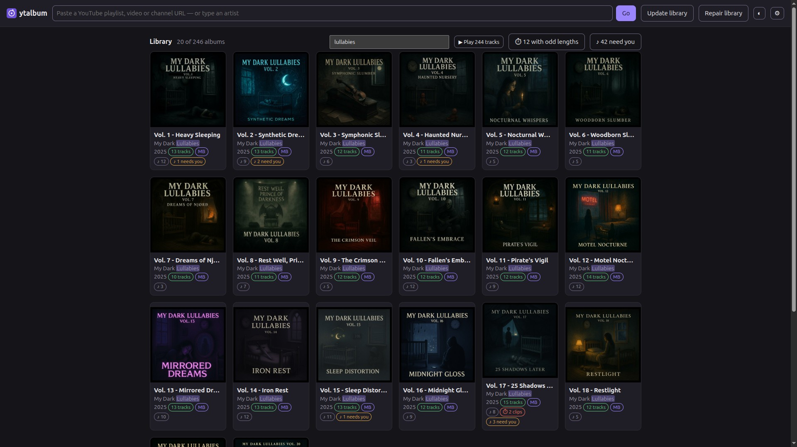
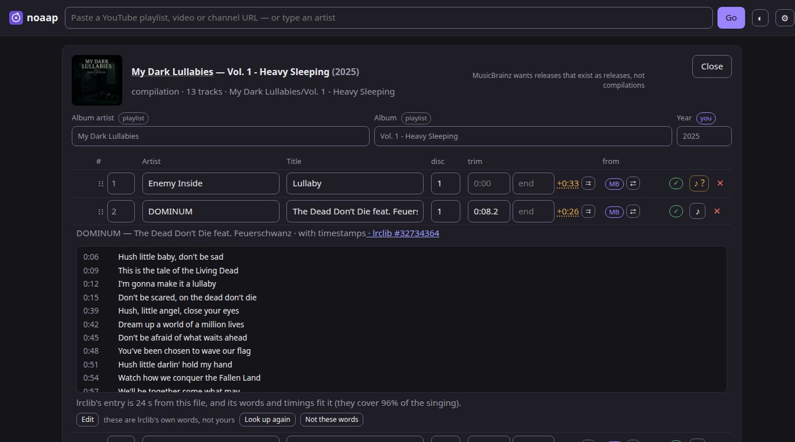
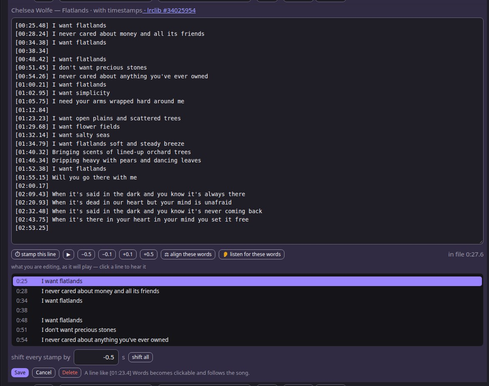
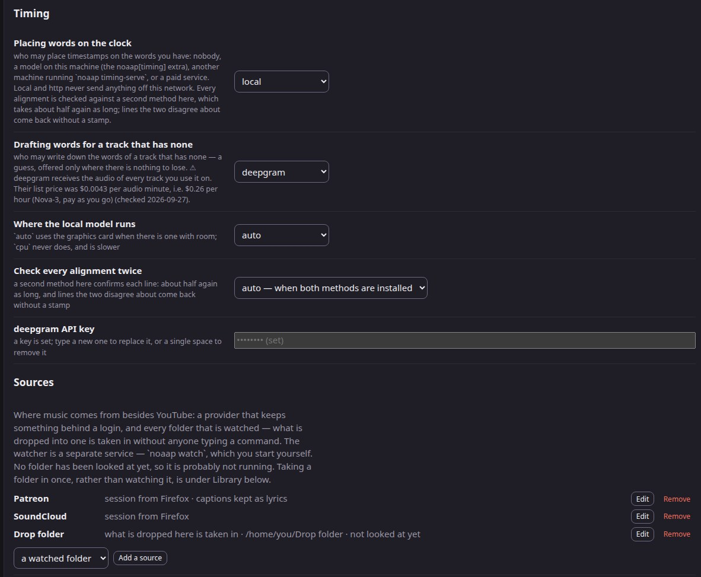
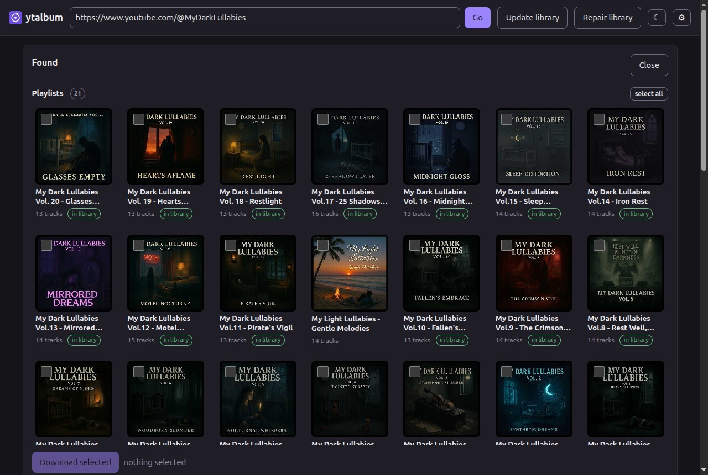
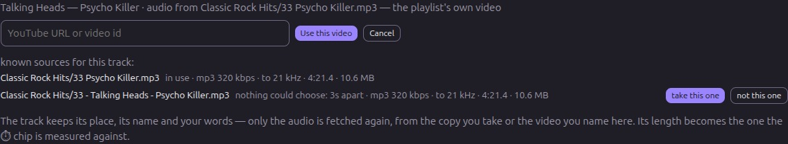

<h1> noaap</h1>

[](https://github.com/smtws/noaap/actions/workflows/tests.yml)
[](LICENSE)

**Not Officially An Audio Player.** This program was called **ytalbum** up to and including 0.9.0;
1.0.0 is the same program under a new name, in a new repository, and a machine set up as ytalbum
keeps working without being told anything — see [Coming from ytalbum](#coming-from-ytalbum).

Turn YouTube playlists into properly tagged albums: correct artist and title per track,
album art, MusicBrainz data where it exists, and the audio copied without re-encoding.
Comes with a command line and a small web app for the library.



## What it does

- **You give it a URL or a name.** A playlist, a video, a channel, or just an artist name.
- **It works out what kind of thing that is:** an official album, an artist's playlist, a
  curated compilation (14 songs by 14 bands), or a single.
- **It finds the real artist and title per track.** YouTube Music's own fields first, then
  the video title (stripping "(Official Video)", label suffixes and the like), then
  MusicBrainz — which also fixes reversed "Song - Artist" titles.
- **One artist, one spelling.** A MusicBrainz credit is how a release is printed, so it can
  shout ("Visions **Of** Atlantis" on three releases of seven); the artist's own spelling wins
  whenever the two differ only in case or punctuation, while a genuinely different credited
  name (an old release as "Puff Daddy") is kept.
- **The artist field stays the performer.** A guest credit moves into the title
  (`Feuerschwanz` / `Ding (SEEED Cover) ft. Melissa Bonny`), so a collaboration does not
  become an artist of its own, and one artist keeps one spelling across the library.
- **It downloads the best audio YouTube has** (Opus, usually 130–160 kbps) and never
  re-encodes it.
- **It tags everything**, embeds the cover and files it as
  `Album artist/Album/Album artist - Album - 07 - [Track artist - ]Title.opus`.
- **An edition is not a version.** "(Deluxe Edition)" names the same recordings and
  MusicBrainz' spelling wins; "(Instrumental)", "(Live)" or "(Track Commentary Version)" do
  not, and an album keeps them rather than being filed as the record it only resembles.
- **It tells you when a track is not the length it should be.** MusicBrainz and LRCLIB both
  know how long a song is; where the file disagrees you see by how much, and an album whose
  tracks are mostly wrong is marked in the library — that is how a Sabaton "album" turned out
  to be eleven track-commentary clips.
- **It fetches the lyrics** where [LRCLIB](https://lrclib.net) has them (roughly three of
  four tracks, half of those with timestamps) and writes them both as a `.lrc` file beside
  the audio and into the tags, so tag-readers and players that want a sidecar both find them.
  Timed lines are clickable — the song jumps there — and the line being sung is marked as it
  plays, which is how a file that carries an intro shows itself: the words drift away from what
  you hear.
- **Every value knows where it came from** (MusicBrainz, YouTube Music, the video title,
  or you), and anything you edit yourself is never overwritten by a later update — and can be
  handed back: the badge that says "you" restores what noaap derived.
- **You can fix an album where you can see it.** Drag rows to reorder (or Alt+↑/↓), set trim
  points from what you are hearing and watch the length come right before you save, write or
  correct lyrics in the panel that shows them, and run the offline tidy-up from a button.
- **Or let a model place them, if you want one.** Off by default and no dependency of noaap: with
  a *timing provider* configured, **"⚖ align these words"** in the editor puts every line on the
  file's clock. It
  writes nothing — the stamps appear in the editor, you play a line to check them and press Save, and
  the words stay yours while the clock is recorded as the provider's. **A line it cannot support
  keeps no stamp**: an aligner places every line whatever you give it, so a line put where nobody is
  singing — the first verses of an entry your cut does not have, say — comes back as plain words with
  the reason beside it, for you to stamp by hand or delete. Measured on twenty real tracks
  before it was built: a median of under a second per line, growled vocals no harder than clean ones
  ([the spike](docs/spikes/2026-09-alignment.md)).
- **You can time the lyrics by tapping.** With the song playing, **"⏱ stamp this line"** (or one
  keystroke) writes the moment you are hearing onto the line the cursor is in and moves to the next —
  in the *file's* clock, which is not the player's on a trimmed track, and rounded to a tenth. Each
  stamp can then be played back and nudged by a tenth or a half until it sits right, or every stamp
  moved together with **"shift all"**. Nothing is saved until you press Save.
- **And you can judge the whole song before saving any of it.** While the editor is open, what you
  are editing is what plays: a list beside the textarea is drawn from the words in it, the line being
  sung is marked there as the song runs, and clicking a line jumps to it. Type a stamp, nudge one,
  shift them all or take a provider's proposal, and the list follows at once — so "does this fit the
  song?" is a question you answer by listening, not by saving and finding out. Cancel and the file
  beside the track is in charge again.
- **A track can take its audio from another video, and remembers the others.** Where the playlist
  holds the official video — theatrical bits at both ends, a spoken passage in the middle — and the
  song exists on YouTube as its own upload, the **⇄** button in the track row points it at that one.
  Every place a track's audio can be had from is listed there, with what each one measured; one you
  turn down is marked *refused* and never offered for that track again. The track keeps its place, its name, its number and your
  lyrics, and only the audio is fetched again. What the marks and the tags described was another
  recording, so they go, and the page says which before it asks. The badge that says "you" puts the
  playlist's video back.
- **When LRCLIB nearly has your recording, you can settle it by listening.** Their entry is matched
  by length, and a live version or a radio edit shares a title — so an entry a few seconds off is
  normally refused. **"⚖ check them"** aligns its words to your file instead and reads the answer off
  the result: the words and the timings fit, or the words are right and your cut needs its own clock,
  or it is another song. Measuring this library found 74 tracks with no words whose entry was only
  seconds away.
- **And you can give your own timings back.** When you have timed a song yourself, **"↑ publish to
  lrclib"** sends it to the database the lyrics came from — no account and no key, and only ever your
  own timed words that LRCLIB has no equal of.
- **An album MusicBrainz has never heard of can be offered to them.** **"Add to MusicBrainz"** opens
  *their* release editor with the boxes filled in — the tracklist, the lengths measured from your
  files, the playlist's URL. noaap submits nothing: you are signed in as yourself and you press
  their button.
- **Re-runs are cheap.** An update checks each album with a single request and only does
  real work when the playlist actually changed.
- **You can find what you have.** Filter the library by album, artist **or song** — matches
  are highlighted, and one button plays them, across albums.

## Install

Needs **Python ≥ 3.14**, [uv](https://docs.astral.sh/uv/), [ffmpeg](https://ffmpeg.org/)
and a JavaScript runtime for yt-dlp ([Node](https://nodejs.org/) ≥ 20,
[deno](https://deno.com/) or bun).

```sh
sudo apt install ffmpeg                             # brew install ffmpeg on macOS

# Node ≥ 20. Ubuntu's own `nodejs` is 18.x on 24.04 and ships no npm, which the token
# generator below needs — so take it from NodeSource, or use nvm, or install deno instead:
curl -fsSL https://deb.nodesource.com/setup_20.x | sudo -E bash - && sudo apt install -y nodejs
curl -LsSf https://astral.sh/uv/install.sh | sh     # if you do not have uv yet

git clone https://github.com/smtws/noaap.git
cd noaap
uv sync                                             # venv + dependencies
uv run noaap config                               # shows what it found: ffmpeg, JS runtime, token helper
```

`uv sync` needs no system Python 3.14 — uv fetches the interpreter itself.

`noaap config` reports whether it found ffmpeg, a JavaScript runtime and the token helper.
**ffmpeg is reported, not required:** a library can be browsed, tagged, searched and have its lyrics
fetched without it — downloading and trimming are what stop, and they stop at the moment of use.

## First run

```sh
uv run noaap config --library ~/Music/YouTube        # once
uv run noaap fetch "https://www.youtube.com/playlist?list=…"
uv run noaap serve                                   # web UI on http://localhost:8765
```

To have the web UI always there without a terminal (Linux):

```sh
uv run noaap service install    # systemd user socket: starts on the first request, idles out
uv run noaap app install        # menu entry with its own window and icon
```

The library, the CLI and the web UI are platform-independent; `noaap service` (systemd)
and `noaap app` (freedesktop launcher) are Linux-only.

**Cookies: the bot check, and age-restricted videos.** After a few hundred requests YouTube starts
refusing everything ("Sign in to confirm you're not a bot"), and some videos are age-restricted in
any case. Both are fixed by the same thing — a logged-in YouTube session, which yt-dlp reads at request time. It does two things: it gets past the bot check, and it unlocks age-restricted videos:

```sh
uv run noaap config --cookies-from-browser firefox   # or chrome, or --cookies-file cookies.txt
```

**Proof-of-origin tokens.** Some videos only hand out their audio streams when the client
presents a token. This needs **two halves**, and `uv sync` installs only the first:

1. the yt-dlp **plugin**, `bgutil-ytdlp-pot-provider`, a Python package already pulled in by
   `uv sync` — `pyproject.toml` pins `>=2.0.0`;
2. the **Node server** that actually mints the tokens, which is a separate repository you clone
   yourself.

The two are versioned together, so clone the branch that matches the plugin you have — check with
`uv pip show bgutil-ytdlp-pot-provider` and use that major version. With the pin at `>=2.0.0` the
2.0.0 branch is the right one today; if the plugin ever resolves to 3.x, clone `3.0.0` instead.

```sh
git clone --single-branch --branch 2.0.0 https://github.com/Brainicism/bgutil-ytdlp-pot-provider.git .pot-provider
(cd .pot-provider/server && npm ci && npx tsc)
```

noaap finds it, starts a local token server when it needs one and stops it after five
idle minutes. `pot_provider_home` defaults to `.pot-provider/server` **relative to the noaap
clone** — not to your working directory — so the command above puts it exactly where noaap looks.
Set the key to an absolute path if you keep it elsewhere.

## Screenshots

| | |
|---|---|
|  |  |
| **Album view:** the cover, every field editable, and where each value came from — `playlist` here, `you` where you have overruled it, and the badge hands the derived value back. Drag a row by its grip to reorder it; the ⏱ column says how far the file is from the length MusicBrainz and LRCLIB know; **⇄** takes a track's audio from another video; ♪ opens the lyrics. Open, they read as timed lines you can click, and the panel says what may be done with them — here, that these are LRCLIB's words and so not yours to give back. The head says why this album is not one to offer MusicBrainz: it is a compilation. | **The lyrics editor:** the same panel, writing. The words are the text in the box, and the list below it is drawn from that text as you type — click a line to hear it, and the line being sung is marked as the song plays, so a proposal can be judged before it is saved. **⏱ stamp this line** writes the moment you are hearing, the nudges move one stamp by a tenth or a half, **shift all** moves every stamp at once, and **⚖ align these words** asks the configured provider to place them all. Nothing is written until Save. |
|  |  |
| **Settings:** the two timing providers are chosen separately — who may place your words on the clock, and who may write down the words of a track that has none — and each says where the audio goes: `local` never leaves the machine, a vendor takes the audio and its list price is shown with the date it was read. A key that is set reads `•••••••• (set)` and is never shown again. Below: what noaap found — config file, JS runtime, token generator. | **A URL or an artist name:** a URL is previewed first — what a fetch would write, and whether the album is already here — and nothing is downloaded until you say so. A name searches instead: here a curator's channel, every playlist it publishes, "in library" markers, tick what you want. |
|  |  |
| **Library:** 20 of 246 albums, because the filter matched a word in their artist — it searches albums, artists and song titles at once, highlights what it matched, and **▶ Play** queues everything it found across all of them. ♪ counts the tracks whose lyrics are here, ⏱ marks an album that is not the length it should be, and **♪ N need you** collects the tracks where LRCLIB has words and the aligner could not decide whether they belong to your file — nothing was taken, and each is one click from the two numbers. Opening one artist instead gives the same view with "check for new albums", which asks YouTube about that artist alone. | **Two copies of one song:** what `merge` could not decide, kept where you can decide it — the panel of one track, opened with **⇄**. Every copy is named by the last two parts of its path (the whole path is in its tooltip) and carries what was measured: codec, bitrate, where the audio stops, length, size. The one in use says so; the other says what stopped the pass from ranking it — here two files that are the same recording by every number there is and **3 seconds apart**, which is inside the range where this program shows you rather than decides. **take this one** fetches it, **not this one** is remembered for good, and the count on the album card can only fall. |

The compilations throughout these screenshots are
[**My Dark Lullabies**](https://www.youtube.com/@MyDarkLullabies) — *"a curated collection
of sleep playlists for restless minds, melancholic souls, and lovers of the night"*, one
themed volume at a time, from darkwave and neofolk to doom and ritual ambient. It is
another AI-assisted project by this repository's owner, and it is the reason half of this
tool exists: twenty volumes of thirteen different bands each, where no release, no
tracklist and no cover exists to look up — so the names have to be earned from the video
titles and MusicBrainz one track at a time.

The one exception is **Two copies of one song**, which is a 1970s rock compilation: none of the
twenty Lullabies volumes holds a copy nobody could choose between, and a panel about two copies has
to be photographed where there are two.

## How it works

```
address ─► resolve ─► inspect ─► classify ─► enrich ─► plan ─► [you edit] ─► download ─► tag
   │
   ├─ youtube:    the only thing that knows what a video id or a watch link looks like
   ├─ soundcloud: a set is an album — for music that is not on YouTube
   └─ folder:     a path on this machine — it copies, and never writes where it read
```

**Where the audio comes from is one small interface.** A *source provider* answers four questions —
what is at this address, fetch this item's audio, what is this item, and get this picture — plus a
few it may decline: can it search, can it say cheaply whether a collection changed, do its titles
carry conventions worth stripping. YouTube is one such provider, and nothing outside it recognises a
video id, a watch link or a channel; a test in the suite greps for exactly that and fails if it
leaks. Each album's plan records which provider it came from, and each track records which one its
audio comes from — so one album can hold tracks from two.

**SoundCloud is the third, and it is for music that is not on YouTube — not for better copies.**
That is not a preference, it is what the site gives: without an account the best it offers is
**160 kbps AAC**, which measures out at 16 kHz where a YouTube Opus of the same song reaches 20–21,
so the "which copy is better" rule will keep what you already have nearly every time. And the
commercial releases this library is largely made of are **DRM protected** there: yt-dlp is handed no
stream at all, that track says so and is skipped, and nothing in noaap goes near the protection.
What SoundCloud is good for is the rest — independent artists, soundtracks, remixes, things that
exist nowhere else.

`noaap fetch https://soundcloud.com/<artist>/sets/<album>` takes a set; a set published on the
artist's **albums** tab is read as a release and any other set as a playlist, which is the site's own
statement about it. `noaap fetch https://soundcloud.com/<artist>` lists what they publish and asks
which. Typing a bare artist name does **not** search SoundCloud — its search finds tracks and never
sets, so the provider does not claim to, and noaap says which providers can. A set's own name is its
album name (the genre an uploader writes into it for the search box is stripped), the year is the
set's, the track numbers are the running order, and a "(snip)" is marked as the preview it is rather
than planned as the song.

**Patreon is the fourth, and it needs your own session — there is no other way in.** It is for music
you already pay a creator for: their own releases, stems, alternate takes. yt-dlp can only reach Patreon
with a logged-in session cookie, and without one even a *public* post answers `403` (measured, not
assumed), so noaap reads the cookies of **your** browser and otherwise refuses and says which setting to
set. **Nothing of that session is stored** — not the cookie, not a copy, not a token; only the setting
saying which browser or file to read, and Patreon's settings are its own, never SoundCloud's.

`noaap fetch https://www.patreon.com/posts/<id>` takes one **post**, which is this provider's album:
nothing on Patreon is a release, so a post holding three files is three tracks in the order the post
lists them, with no track numbers invented and no year claimed. `noaap fetch https://www.patreon.com/<creator>`
lists that campaign's posts, newest first, **at most 200 of them** (`patreon_post_cap`), and checks that
every post it was handed really belongs to the campaign you asked for. A post that is a YouTube or
SoundCloud link with a note is read as *that* service's track, because that is whose audio it is.

**A video post's audio, if you ask for it.** Some creators post what is really an audiobook or a
narration as video. `patreon_audio_from_video = true` takes the **audio stream** out of such a post —
copied, never re-encoded, so what lands in your library is the creator's own stream bit for bit. The
rendition is chosen by its *audio* and then by the smallest picture carrying it (Patreon's ladder
repeats the same AAC at every size, so this is a large saving in bytes and none in quality); the video
itself is downloaded into a scratch directory outside your library, never kept, and deleted whether
the copy worked or failed. Off by default, and a video post is then refused in a sentence naming this
setting. A post with DRM, a password or any other protection is refused by name, and nothing is
attempted against it. The track's copy records that its audio came out of a video, what the file
measures as, and where its audio stops.

**The words that came with a post, if it has any.** Some creators caption what they post, and for a
narration those captions are the text of what is being read. `patreon_captions = true` keeps them
**beside** the track as an `.lrc`, with one stamp per line taken from each caption's start — and
nowhere else: they are never written into the audio file's tag, never published to LRCLIB, and never
offered to anybody, because they are the creator's writing and not yours. The panel says whose they
are, and the *"I have corrected these words, they are mine"* control is not offered for them:
correcting a line of somebody else's text is not authorship of it. They are refused, with the reason
said once, when the platform generated them rather than the creator, when the file is not WebVTT,
when they are served from a host this provider does not read, or when the post's audio does not start
at exactly zero — a caption file is timed to the whole asset, and a constant offset on every line
looks right and is not. Off by default.

What a post actually serves is usually not a file but a **playlist** of WebVTT segments, and that is
read too: the playlist, then each segment in order, then the cues joined into one list with a cue
that spans two segments appearing once. Every address is checked before it is asked — the playlist
and each segment, after resolving it against the playlist — and one segment from somewhere else
refuses the whole track rather than writing half of it — and every address is checked before *any*
of them is fetched, so a bad one costs no requests at all. Each segment has to be a caption file by
its own first line, so an error page in the middle of a chapter refuses the track instead of leaving
a hole in it (an empty segment is fine: that is a silence). A playlist of playlists, an encrypted one
(no key is ever fetched), one that is still being written, one whose segments are byte ranges of
another file and one that lists the same segment twice are each refused by name, as is more than
**600 segments or 8 MB**. A dry run says what taking them would cost, and the track's own line says what it did cost — the
requests, the segments, the bytes, and which of the two timestamp conventions the segments used.

**Run against a real post on 2026-09-29:** one post whose captions came as a playlist, taken in
**49 requests**, joined into **341 lines** — ordered, without duplicates, the last stamp 4.08 s
inside the audio's 23:31 — written as one `.lrc` of 27,903 bytes beside the track, with nothing in
the file's tag and no address of any kind in the plan.
What that run did *not* exercise: a post serving a plain caption file, captions the platform
generated, any of the refusals against the live site, and more than one post. And what is **not
known** from it: whether a line sits where it is actually spoken — the stamps were checked for range
and order, never against the speech — and which timestamp convention those segments used or how many
bytes they were, neither of which that run recorded (both are recorded now).

**And its audio does not go to a timing provider that is not this machine.** Aligning words or
drafting them sends the *recording* — so for an album from a private source that only happens with a
provider running here: `local`, or `http` pointed at this machine. A vendor is refused in one
sentence, and the page does not offer the button. If you want it anyway for one album, set
`"send_audio": true` in that album's plan — a switch of its own, because letting a title be looked up
(`"lookups": true`) is not the same as letting the recording be uploaded.

**A private album's plan holds no address of its own.** The addresses Patreon hands out for a paid
post's image are *signed* — they carry a token in the query — and a signed address is a piece of your
session, so nothing of the sort is written into a plan. The cover is fetched while the post is being
read, with the address that read just produced, or it is not fetched at all; a plan written before
this rule is cleaned the next time anything saves it.

**Nothing from Patreon is offered to anyone else.** A track whose audio came from there cannot be
published to LRCLIB, its album cannot be seeded to MusicBrainz, and — because a *lookup* also sends a
title, a creator and a length to somebody else's server — such an album is not looked up at either of
them at all. It is what one person paid one creator for. If you want one particular album looked up
anyway, set `"lookups": true` in that album's `.ytalbum.json`; nothing in noaap sets it for you.

**What it never does:** fetch anything your tier does not include (that post says so and is skipped, and
the album goes on), fetch for anybody but you, go near DRM or any access control, or crawl a creator.

**It has been run against Patreon on 2026-09-29**, against one campaign the owner of this
installation supports, with their own Chrome session. What those runs exercised: the session
(Chrome's cookie store, read by yt-dlp, nothing stored), the campaign listing with
`patreon_post_cap = 5` against a campaign of 584 posts, five full post reads, and — at the end of the
day — **one real fetch**: the shortest of the five posts, a 23½-minute narration, its audio copied out
of the video (16.6 MB kept, aac 96 kbps, 44.1 kHz, length matching the source manifest to four
decimals, measured cutoff 15 kHz), tagged, and `update` run once over it, which changed nothing.
What is still **untried against the live site**: a post that holds audio as a file, a post with
attachments, a post outside the tier, more than one post in a run, and the cover's fallback (the one cover this
provider has been asked for could not be fetched, which is what led to the fix in the paragraph
above). Treat those as new.

Two things that run taught, both of them traps:

- **A flat campaign listing gives no titles.** Patreon answers a feed with bare addresses, so the
  picker shows each post's *address slug* — the creator's own words, not the post's real title. The
  title arrives when the post itself is read.
- **On Linux, reading Chrome's cookies needs a keyring that is unlocked, and `secretstorage`
  installed.** Without it yt-dlp cannot decrypt a `v11` cookie: it drops them silently, and Patreon
  then answers as if you were a stranger. A session that looks set and does not work is this.
- **You do not have to open the browser first.** noaap used to need a visit to patreon.com within
  the last half hour, and that turned out to be about the *handshake*, not the session: yt-dlp pins
  a cipher list of its own on every connection, and Patreon's bot check refuses that — measured, same
  cookies and same minute, Python's default ciphers answering `200` where the pinned list answered
  `403`. For Patreon, noaap now lets the connection be an ordinary Python one. Nothing is made to
  look like a browser and no impersonation library is involved; the one cost is that this provider's
  requests also permit legacy TLS renegotiation, which is the other half of the option that does it.
  A `403` now means what it says: **sign in again**.

**A folder on this machine is the second one.** `noaap fetch ~/Music/some-album` reads the files'
own tags and copies the audio into the library; `noaap fetch ~/Music` lists the albums underneath
and asks which. Nothing is written, moved or re-encoded where it was read, and what is not a track
— a stray `.url`, a thumbnail cache, a label logo — is counted in the report and left alone.

The files decide, in this order: **their own tags**, then the **file name** where a tag is missing,
then the **folder name**. Each value records which of the three it came from, so the page and
`noaap plan` can show you. MusicBrainz fills gaps but never overrules a tag that is there — whoever
tagged that collection knew more about it than a lookup does. Numbered sub-folders (`cd1`, `CD 2`,
`1`) are the discs of one album. An `albumartist` is what says an album is one artist's, so a guest
credit on one track does not turn it into a compilation — and `Various Artists` is the one value
that means the opposite.

An album whose artist and name are **already in your library** is reported with how many of its
titles overlap, and then left alone: choosing between two copies of a recording is a decision of its
own, and noaap does not make it quietly in the middle of an import.

## A collection you already have

`noaap adopt <folder>` takes a collection in **where it stands**. It reads every album folder under
that root and writes one file per album — the plan, beside the audio you already arranged. Nothing
is renamed, no folder is moved, and **not one tag is written into your files**. Dry by default;
`--apply` writes the plans, `--only` and `--album` narrow it.

That is the whole of it, and it is enough for a library: the page, the player, lyrics, the length
check and `merge` all work off the plan. The album is marked as **yours, not noaap's** — every
ordinary pass afterwards leaves its names and its tags alone, which is the thing that had to be
built for this to be safe at all.

**Discs in sub-folders stay in them.** A plan records each track's file as a path relative to the
album — `cd1/…` when that is where it is — and no pass moves it, copies it or renames it out of its
folder. If you adopted a collection with **1.5.0**, run `noaap repair` once before anything else:
those plans recorded only the bare name of a file in a sub-folder, and the first `update` after them
copied it into the album's root. `repair` looks each file up where your collection says it is, and a
finished track of an adopted album is never fetched again in any case.

**A cut file starts at zero.** Until 1.18.0 the cut kept the packets before the trim point and marked
them with negative timestamps (`start_time = -0.900000` for a 4.9 s trim), which left a player with a
clock running past the length it was told and — with the bug below — made the *next* track in the queue
begin a few seconds into itself. The cut drops those packets now and the first stamp is `0.000`; the
cost is the one 20 ms packet the trim point falls inside, and nothing is re-encoded. Files cut by an
older version are found by their own start time and **cut again from the untouched original** beside
them: `noaap repair --dry-run` names each one (*"01 would be cut again: its clock starts at -0.900 s"*)
and says so when no original is kept, in which case nothing is touched.

**A save never interrupts what you are hearing.** When a trim is saved, the page updates what it
knows — which file to ask for next time, and what the saved marks are — and the sound carries on. The
next time you start that track it plays the untouched original with the trim previewed, which is how a
cut track is always played. Marks you have moved but not saved are kept when the page refreshes.

**And the trim window is only ever applied to the file the player actually loaded.** A cut track is
played from its untouched original, so the marks and what you hear share one clock; where the player is
holding the cut file instead — the seconds between a save and the page learning of it — the cut is
already in the bytes and nothing is added to it. Getting this wrong is what made a cut track begin 4.9 s
into itself and the track after it start at 4.948 instead of 0.

**Read the dry run before the real one, and it will tell you about the audio files.** `--dry-run`
prints one line per track for everything the pass would do — *would be renamed*, *would be retagged*
with the values that change, *would be cut to its trim points* — and ends with its own total:
*"0 file(s) would be renamed and 18 audio file(s) would be rewritten (their tags)"*. Anything the real
run does is in that list; a test compares the two sets on a fixture album so it stays that way.
Version 1.17.0 and earlier reported only lengths and albums, and the run that followed rewrote 376 of
one library's audio files.

**Why a tidy album still gets its tags rewritten once.** LRCLIB ends a synced lyric whose singing stops
before the track does with a bare timestamp — `[03:52.92] `, trailing space and all. Until 1.18.0 that
space was written into the file's lyrics tag while the reader strips it, so every such track read as
out of date on the next pass and `repair` rewrote the file for **one character** (measured: −1 byte on
18 of 31 files of two albums). New sidecars no longer carry it; files written before this still get one
catch-up rewrite, and now the dry run says so, down to the character: *"lyrics differs from character
2031 of 2032 → 2031"*.

**A file you renamed or moved is found again: `noaap repair --find-moved`.** It asks what a file
*holds*, not what it is called — so a track you renamed, or moved into a disc folder, is re-attached to
its plan. Reports only until you add `--apply`, and **no file is ever moved or written by it**: what
changes is what the plan says. It never guesses: where two files hold the same recording, or none does,
the track is named and left as it is. A file that ended up in **another album** is named too, and not
taken — that album's plan is not this one's to write. Renaming a whole album folder needs none of this,
because a plan travels with its folder. And if the folder an album was **taken in from** has moved,
`--find-moved --under <where it is now>` points the album at it, by the same question.

**And if that already happened, `noaap repair --strays` takes the copies back out.** It looks in the
root of every adopted album whose discs are sub-folders, and moves a file to the recycle bin only when
all four of these are true: the name is one the plan points at or one noaap would have written; its
**decoded audio** is identical to a file in one of the disc folders; and that file is one the plan
holds. Anything short of all four is printed with the reason and left where it is. **It reports and
does nothing until you add `--apply`**, nothing is ever deleted, and each bin entry names the file it
was a copy of and the evidence. Afterwards the album's plan points at your own files again and
`--undo` can give the album back, which it refuses to do while a copy is still in there. One album shape is refused
rather than adopted: one whose discs are *sibling* folders (`An Album CD1`, `An Album CD2`), because
its files are not inside the album folder at all — adopt the folder that holds them.

Two things you can ask for afterwards, each on its own: **`--rename`** gives the files noaap's
names **where they stand**, and still leaves the folder where you put it, and **`--retag`** writes the plan's fields in
while keeping every field this program does not model — replaygain, ISRC, composer, BPM, your own
comment. Neither runs on an album whose record of what it was is missing, because:

**`--undo` gives an album back.** Every file answers to the name it had, every field noaap would
ever write has the value your file gave it, and the audio stream is untouched. What noaap added is
removed — unless you have edited it since, in which case it is yours now and it stays, and the undo
says so. That includes a **cover file** noaap saved for an album that had none: it is recognised
either by the hash noaap recorded or by being byte-for-byte the picture inside the album's own files,
which is what makes it removable in a library written by 1.4.0 or 1.5.0, where the record was lost.
A cover of your own stays, as everything of yours does: adoption writes down every non-audio file
that was already in the folder, and nothing noaap does afterwards removes one of those. And because
the picture proof is the weaker of the two, a cover found that way is moved to the recycle bin rather
than deleted — `noaap recycle` lists it and can put it back. Only a file whose hash noaap itself
recorded is deleted outright. The tag *block* does not come back byte for byte: mutagen rewrites it whole, and a writer
putting the same values back cannot put the same padding back. The names, the fields and the audio
are the promise.

The recycle bin lives at the root of the library — which, for a collection adopted in place, is
**inside your own music folder**, as `.recycle`. Nothing else noaap does puts a file there.

```sh
noaap adopt ~/Music/my-collection                  # what it would write
noaap adopt ~/Music/my-collection --apply          # write the plans
noaap adopt ~/Music/my-collection --undo --apply   # give it all back
```

## A folder that is watched

`noaap watch` looks at the folders you name in the config file and hands what arrives in them to
the app. **It never does the work itself**: it notices, waits until the arrival has stopped moving,
and asks for an ordinary job — the same one `noaap fetch <folder>` would run. Nothing is watched
unless you configure it, and the settings panel and `noaap config` both say what is being watched.

Two shapes, and they may not be nested:

```toml
[[watch]]
name = "drop"                    # things dropped here are taken into the library,
folder = "~/Music/drop"          # and the folder itself is left exactly as it is
shape = "intake"

[[watch]]
name = "mine"                    # an adopted library watching itself: you add, change
folder = "~/Music/collection"    # or remove files in place and the plans follow
shape = "library"
```

An intake folder may not hold the library and the library may not hold an intake folder — a library
that watches itself is the second shape and needs no intake at all.

It waits for quiet rather than for an event: a file that is still being copied never settles, a
download client's temporary name is ignored until it is renamed, and an album arriving one track at
a time is taken when the last of them stops moving. **Nothing is ever deleted by the watcher**: a
file that disappears is recorded in the plan, never a reason to remove anything.

It is a separate service you start yourself, because the web UI is started on demand and stops
itself again, while a watcher has to be always on:

```sh
noaap watch --once                   # one look, to see what it would do
noaap watch-service install          # as a user service, always on
systemctl --user stop noaap-watch    # and that is how you stop it
```

## Two copies of one song

`noaap merge <another library>` looks at both, pairs what is the same song, and tells you which copy
is better. It changes nothing until you add `--apply`, and the library you point it at is never
written to at all.

**It measures the audio rather than believing the file.** A container and a bitrate are claims: a
FLAC can be a decode of a 128 kbps mp3, eight times the size and exactly as good. So each file is
decoded once and split into 1 kHz bands from 14 to 23 kHz, and the highest band that still holds
content is where that file stops. A FLAC made from an mp3 reads 17 kHz; a FLAC made from a YouTube
Opus reads what that Opus reads; a real CD rip reaches 22 kHz, which is where 44.1 kHz audio has to
stop, and it is not the worse file for that.

The order of the rule, and it is short:

1. **Your own work wins.** A trim you marked, a source you chose, words you *timed* to this file —
   none of that is outranked by a measurement.
2. **Is it even the same recording?** Within 3 seconds yes, beyond 20 no, and in between it is shown
   rather than decided. Where MusicBrainz or LRCLIB knows the length, both files are measured against
   that instead of against each other, because both can be padded.
3. **Then quality, on measured things only.** A wider band decides — by 2 kHz, because one
   kilohertz is inside what a single encoder varies by. A file that reaches its own ceiling beats one
   that does not, by any margin. **A lossless copy that gives up nothing takes the place of a lossy
   one**: same recording, and its measured band not narrower than what you have. It is the copy worth
   keeping, because it can be re-encoded later without losing a second time. The reverse is not true —
   a lossy file never displaces a lossless one on its container, and a *narrower* lossless copy wins
   nothing. A bitrate decides only against the same codec. A tie goes to the copy you already have.

**Anything it cannot settle is kept where you can settle it.** `--apply` writes the other copy onto
the track — listed, not chosen, nothing copied — with the sentence that failed to choose and both
files' numbers: codec, rate, where the audio stops, length, size. The ⇄ panel then offers *take this
one* and *not this one*, the album card counts the tracks that are waiting, and a refusal is
remembered for good. Nothing is ever removed except through the recycle bin, whose entry records both
copies' numbers; restoring one puts your file back and makes sure that proposal never returns. And
when a copy you take arrives in another format, **the file it replaces goes to the bin too** — an
album folder never holds audio no track of it names.

**When the rule changes, the copies already listed can be asked again.** `noaap merge --rejudge`
re-judges every copy waiting in your library under the current rule — it reads the numbers each copy
was recorded with and **opens no audio file**, so it costs a read of the plans. It prints what would
change and changes nothing; `--apply` then does exactly what a merge does with such a verdict, which
for a replacement means the displaced file goes to the recycle bin. A copy whose numbers were never
fully recorded is left alone, and so is a track you trimmed, chose a source for, or timed your own
words to.

```sh
noaap merge --rejudge                          # ask the current rule about the copies on the list
noaap merge ~/Music/other-library              # show what it would do
noaap merge ~/Music/other-library --undecided  # only what it will not decide for you
noaap merge ~/Music/other-library --apply      # do it
noaap merge ~/Music/other-library --only Dominum --apply   # one artist, both sides
noaap merge ~/Music/other-library --new --apply            # and fetch the albums you do not have
```

Each album folder holds a **plan** (`.ytalbum.json`): what the source listed, what each
track should be called, where every value came from, what has been downloaded, and which
trim points apply. The plan is the only state — delete it and the album is just files;
keep it and everything is repeatable.

That file name is deliberate. It is the **format's** name, not the program's, so it did not change
with the rename: a library written by noaap still opens in ytalbum 0.9.0, and one written by ytalbum
opens here. Renaming it would have made every album invisible to the older program, which would then
have re-fetched each one into a second folder beside the first.

- **Your edits win.** The plan records the value noaap derived. A value that differs from
  it is yours and survives every update; untouched values follow better data when it
  appears.
- **Nothing is decided on half-knowledge.** If any video can't be read (bot check, network),
  the run changes nothing at all instead of classifying or renaming from a partial view.
- **An alternative source does not change what a track is.** The playlist's video stays the
  track's identity — its order, whether it is still in the playlist, what MusicBrainz matched — and
  only the audio comes from elsewhere. The uploader follows the audio, because "trim everything from
  this channel" is about whoever encoded the file in front of you.
- **Trimming is non-destructive.** The untouched original goes to `.originals/`, cuts are
  made from it with `ffmpeg -c copy`, and clearing the trim restores it byte for byte. Marks are
  set while listening — "start here", "end here", drag the handles, or arrow keys for tenths —
  and the bar says what the cut would leave against the length MusicBrainz or LRCLIB knows, so
  the gap can be watched closing before anything is saved. A cut track is played from its
  original, because the marks count from the start of the video.

More detail, including what was measured and deliberately rejected, is in
[DESIGN.md](DESIGN.md).

### On disk

```
Library/
└── My Dark Lullabies/
    └── Vol. 1 - Heavy Sleeping/
        ├── My Dark Lullabies - Vol. 1 - Heavy Sleeping - 01 - Enemy Inside - Lullaby.opus
        │                                             ↑ "1-01" on an album with several discs
        ├── …
        ├── My Dark Lullabies - Vol. 1 - … - 01 - Enemy Inside - Lullaby.lrc   # the lyrics
        ├── cover.jpg              # replace it with your own and noaap keeps it
        ├── .ytalbum.json          # the plan
        └── .originals/            # only when trims are in use
```

### What goes into the tags

Every finished file carries these, written with [mutagen](https://mutagen.readthedocs.io/):

| tag | from |
|---|---|
| `title`, `artist` | the track, after the name fixing above |
| `albumartist`, `album` | the album |
| `tracknumber`, `tracktotal`, `totaltracks` | position and size |
| `date` | the album year, when there is one |
| `compilation` | `1` on a compilation |
| `discnumber` | on a multi-disc album |
| `musicbrainz_albumid`, `musicbrainz_trackid` | when MusicBrainz matched |
| `lyrics` | a copy of the `.lrc` beside the file |
| **`youtube_id`** | **the video id this track came from** |
| **`source`** | **the playlist or video URL** (the `©cmt` comment field in `.m4a`) |
| cover | the album art, embedded |

The last two are worth saying plainly: **the video id and the source URL go into every file you
keep.** Nothing else in the tags identifies where the audio came from, and nothing strips them.

### Editing a plan by hand

`noaap plan <url>` writes `.ytalbum.json` and stops. It is ordinary JSON; edit it and run
`noaap download <folder>`.

| field | safe to edit | what happens |
|---|---|---|
| `artist`, `title`, `album`, `albumartist`, `year` | yes | the file is renamed and retagged |
| `number`, `disc` | yes | tracks are renumbered and renamed |
| `trim_start`, `trim_end` | yes | the cut is made from the kept original |
| `source_override` | yes | the audio is fetched again from that video |
| `lyrics` and the `lyrics_*` fields | no | derived from the `.lrc` beside the file; edit that instead |
| `video_id`, `source_id`, `source_url`, `folder`, `filename` | no | identity and what is on disk |
| `candidates`, `chosen` | no | derived — see below |
| `refused_candidates` | carefully | a list of refs never to offer for this track again |
| `auto`, `provenance` | no | see below |

**`candidates` is derived, `source_override` is the truth.** Each track lists every place its audio
can be had from, and `chosen` says which is in use — but both are worked out from `video_id` and
`source_override` every time the plan is loaded. Where they disagree, the old two win and the list is
rebuilt from them. That is deliberate: an older noaap sharing the same library writes
`source_override` and knows nothing about candidates, and it must not be silently overruled. So to
change a track's audio by hand, set `source_override`.

**Why `auto` and `provenance` are not yours to edit.** `auto` holds the value noaap derived for
each field; `provenance` says where that value came from. A field whose value differs from `auto` is
treated as *yours* and is never overwritten by a later update — that is the whole mechanism. So
editing a value is how you take ownership, and editing `auto` to match only throws your edit away at
the next pass. The web UI's "you ↺" badge simply restores the `auto` value.

## Command line

| Command | What it does |
|---|---|
| `noaap fetch <url>` | Plan and download a playlist, video or channel. `--dry-run` prints the plan only, `--pick 1,3-5` / `--all` choose from a channel, `--no-mb` skips MusicBrainz, `--library PATH` overrides the library, `--dump-collection FILE` also saves what YouTube returned (for test fixtures), `--no-lyrics` skips the lyrics lookup. |
| `noaap search <artist>` | Find an artist's albums, singles and playlists and pick from them (`--pick`, `--all`, `--dry-run`, `--library`, `--no-mb`, `--no-lyrics`). |
| `noaap plan <url>` | Write the plan into the album folder without downloading, for editing by hand (`--no-mb` skips MusicBrainz). `--verify` instead reads every plan in the library and reports anything a rewrite would lose — it writes nothing, and names any field a newer noaap left behind. See **[editing a plan by hand](#editing-a-plan-by-hand)**. |
| `noaap download <album-folder>` | Run an (edited) plan: fetch what is missing, rename, retag, trim. `--no-lyrics` skips the lyrics lookup. |
| `noaap update` | Re-check every album against its source, and measure the files of the albums it touches. `--dry-run` only reports, `--deep` reads every album fully instead of skipping unchanged ones, `--no-mb` / `--no-lyrics` skip the lookups. |
| `noaap prune <album-folder>` | Move tracks that are no longer in the source playlist to the recycle bin (asks first, `--yes` skips). |
| `noaap delete <album-folder>` | Delete an album, or one track with `--track <video-id>` (asks first, `--yes` skips). The audio goes to the recycle bin. |
| `noaap serve` | Web UI. `--host 0.0.0.0` exposes it to the network (**no login!**), `--port`, `--idle-exit SECONDS` (0 = never, which is the default for `serve`). |
| `noaap service install\|status\|restart\|uninstall` | Run the web UI on demand via a systemd **user** socket: the first request starts it, it stops itself when idle. `install` takes `--port` (default 8765) and `--idle-exit SECONDS` (default 900). `restart` refuses while a job runs unless given `--force`. |
| `noaap app install\|status\|uninstall` | Desktop launcher (Linux) that opens the UI in a window of its own instead of another browser window. `--browser` picks which Chromium-based browser to use, `--port` which port to open; `--remove-profile` on uninstall also drops the app's browser profile. |
| `noaap watch` | Look at the configured folders and hand what arrives to the app. `--once` for a single look; `noaap watch-service install` runs it as a user service. |
| `noaap config` | Show the settings. With a setter — `--library`, `--cookies-from-browser`, `--lyrics` — it **writes** the configuration file and says so, naming the file and what changed. Without one it reports and writes nothing. Note that `--library` on every *other* command only overrides the library for that run. |
| `noaap adopt <folder>` | Take a collection in where it stands: one plan per album, nothing renamed and nothing written into your files. `--apply` writes, `--only` / `--album` narrow, `--rename` and `--retag` are separate acts afterwards, `--undo` gives it back. |
| `noaap repair` | One-off, offline: performer-only artist names, guest credits moved into the title, the album's own name removed from its track titles, one spelling per artist, duplicate tracks removed — renames and retags, no downloads. It also gives every finished track the **measured length of its own file**, which is the one thing a tidy library never got: the pass that measures used to be skipped for any album whose names were already right. `--dry-run` names everything the real run would do — **per track**, including which audio files would be rewritten and which tag values would change — and writes nothing. |
| `noaap lyrics` | Fetch the lyrics of every track that has none yet — a `.lrc` beside the file plus a `LYRICS` tag. Nothing is downloaded and nothing is asked twice. `--artist NAME` limits it, `--refetch` looks every track up again (lyrics you wrote yourself are always kept). `--near` then goes after the tracks LRCLIB refused on length — a **near miss**, explained under [when LRCLIB nearly has your recording](#near-misses-when-lrclib-nearly-has-your-recording): for each one with no words it aligns the nearest entry to the file and decides by the result, exactly as **⚖ check them** does for one track — add `--dry-run` to see what it would cost first, which looks up but aligns nothing. Needs a provider that can align. A track LRCLIB has nothing at all for is remembered as such, so the next `--near` does not ask about it again; `--refetch` asks anyway. The first `--refetch` over a library written before this version also asks LRCLIB what each stored entry says, to tell your edits from its own words — one extra request per track whose lyrics are no longer in the month-long cache, and never again afterwards. |
| `noaap timing-serve` | Run the local aligner as a small HTTP service so another machine can use it: `--port 8770`, `--host` (**`0.0.0.0` by default** — the point is to be reachable), `--device auto\|cpu\|cuda`. Only needed for the `http` provider; see "placing lyrics on the clock" below. |
| `noaap recycle list\|restore\|empty` | What noaap moved aside instead of deleting. `restore <entry>` puts one back; `empty [--older-than DAYS]` is the only thing that ever removes one. |
| `noaap config` | Show or change settings: `--library`, `--cookies-from-browser BROWSER[:PROFILE]`, `--cookies-file FILE`, `--lyrics on\|off`. |

`-v` / `--verbose` before the subcommand turns on debug logging for any of them.

Exit codes: `0` fine, `1` something failed, `2` wrong usage, `3` YouTube is blocking
requests, `130` interrupted.

## Web UI and HTTP API

`noaap serve` listens on `127.0.0.1:8765`, serves the app and a small JSON API. The app
is a single HTML page with no build step, and it can be installed as a PWA.

Installing it from the browser works, but the window keeps the browser's window class
(Chrome reports `WM_CLASS = "crx_<app-id>", "Google-chrome"`), and desktops group the
taskbar by that class — so it appears as another browser window, with the browser's icon.
No manifest setting changes this; the class comes from the browser process. `noaap app
install` writes a launcher that starts the browser with `--class=noaap` and a profile
directory of its own (the flag is only honoured by a browser process of its own), giving
the app its own taskbar entry and icon.

**The library view** sorts by artist, then year, then name — a discography reads
chronologically, and compilations without a year keep their natural order (Vol. 1 … Vol. 20).
A rail of initials down the side jumps to the first album of a letter (it appears once three
or more are in view), and a button returns to the top of a long library.
<kbd>/</kbd> jumps to the filter, which searches albums, artists and song titles at once:
matching text is highlighted, <kbd>Enter</kbd> moves into the results, <kbd>Esc</kbd> clears
it, and **▶ Play** queues everything it found. Opening an album from a filtered view tints
the fields that matched — an input's value cannot be highlighted character by character, so
the whole field is marked instead. Matching ignores case, accents and punctuation, including
the letters Unicode cannot fold (`njord` finds *Njǫrð*) and umlauts typed the German way
(`knueppel` finds *Knüppel*).

**Playback keys.** While something is playing: <kbd>Space</kbd> pauses and resumes,
<kbd>←</kbd>/<kbd>→</kbd> seek ten seconds (thirty with <kbd>Shift</kbd>), <kbd>n</kbd> is the
next track and <kbd>b</kbd> goes back. These are handled in the page and always work.

The keyboard's own media keys go through the Media Session API, which this page implements
fully (play, pause, stop, seek, track changes and the playback state). **On Linux they may
still land in the wrong browser:** Chrome claims the legacy `org.gnome.SettingsDaemon.MediaKeys`
grab, which GNOME's and Cinnamon's key daemon honours ahead of MPRIS, so an idle Chrome keeps
the keys while Firefox plays. Routing them to whichever player was last active fixes it:

```sh
sudo apt install playerctl        # then bind the media keys to:
playerctl --player=playerctld play-pause   # next, previous, stop accordingly
```

`playerctld` starts on demand over D-Bus; add it to your session's autostart so it sees
players from the beginning.

**Safety:** localhost only by default; writing calls need the header `X-Noaap: 1` and a
JSON content type (so other websites cannot use it through your browser); the `Host` header
must be ours (DNS rebinding); files are only ever served by album and video id, never by a
path from the request; strict CSP, and thumbnails are fetched by the server so the page
never talks to Google. There is **no authentication** — do not expose it to an untrusted
network.

### Reading

| Endpoint | Returns |
|---|---|
| `GET /api/state` | Library (albums with progress), recent jobs, settings, whether something is running. |
| `GET /api/album?id=<source-id>` | The full plan of one album. |
| `GET /api/tracks` | Every track by album as compact rows (video id, artist, title, downloaded, trim points), with a version that changes when any plan does — what the library filter searches and plays. |
| `GET /api/cover?id=<source-id>` | The album's cover image. |
| `GET /api/thumb?u=<url>` | A thumbnail, fetched by the server (allow-listed hosts only, cached). |
| `GET /api/audio?id=<source-id>&v=<video-id>` | The track's audio, with `Range` support so players can seek. |
| `GET /api/job?id=<n>` | One job with its full log and result. |
| `GET /api/lyrics?id=<source-id>&v=<video-id>` | One track's lyrics as the `.lrc` beside it has them, with `status`, `lrclib_id`, `owner` (`user` when they are yours), `words_by` and `timed_by` (who drafted and who timed them, when it was not a person), `timings` — set when the timestamps were written against a different file than the one on disk — `publish` (whether they may be given back to LRCLIB, and why not when they may not), `fit` (what was made of an entry that was nearly this recording) and `can_check` (whether ⚖ can be offered). |
| `GET /api/mbseed?id=<source-id>` | The fields for MusicBrainz's own release editor, and its URL. Nothing is sent from here — the page builds their form with these and you submit it yourself. Refused, with the reason, for an album that is not one to offer. |

### Writing (POST, JSON body, header `X-Noaap: 1`)

| Endpoint | Body | Effect |
|---|---|---|
| `/api/open` | `{q}` | A URL or an artist name: preview, channel listing or search (the **read lane** — see [the two lanes](#the-two-lanes) below). A preview is a dry run — it reads from YouTube (and MusicBrainz, if that is on) exactly as a fetch does, so it costs the same requests, and it writes nothing. |
| `/api/fetch` | `{urls: […]}` | Plan and download those sources. |
| `/api/update` | `{artist?, deep?}` | Re-check the library, or one artist's albums. |
| `/api/repair` | `{}` | Run `noaap repair` over the library: renames and retags only, nothing downloaded. Refused while another job is changing the library. |
| `/api/edit` | `{id, edits}` | Album and track fields, trim points, audio choice, and a track's audio source (`source`: a YouTube URL or video id; empty puts the playlist's video back). Renames and retags; a changed source is fetched again. |
| `/api/trim_channel` | `{channel, start, end}` | The same trim for every track from one uploader. |
| `/api/prune` | `{id}` | Delete tracks that left the playlist. |
| `/api/draft` | `{id, video_id}` | Ask a transcribing provider what it hears on a track that has **no** words. Read-lane, writes nothing, refused for a track that has words. |
| `/api/align` | `{id, video_id, text}` | Ask the configured timing provider to place those words on that track's clock. Read-lane: it writes nothing and the answer (`timed`, with a `start` per line and `null` where it would not place one) goes back to the page. Refused when no provider offers `align`. |
| `/api/lyrics` | `{id, refetch?}` | Look up the lyrics of one album's tracks that have none yet; `refetch` asks about every track again (never about lyrics you wrote). |
| `/api/save_lyrics` | `{id, video_id, text}` | Write the lyrics of one track as given: the `.lrc` beside it, the `LYRICS` tag, marked as yours. Empty `text` removes them. Nothing is looked up, and it is refused while another job holds that album. |
| `/api/check_lyrics` | `{id, video_id}` | Align LRCLIB's [near-miss](#near-misses-when-lrclib-nearly-has-your-recording) entry for that track against your file and decide what may be taken from it: the words and its timings, the words with our own stamps, nothing, or a rejection that is remembered. Needs a provider that can `align`. |
| `/api/take_plain_lyrics` | `{id, video_id}` | Put a near-miss entry's words beside the track without its timings. They stay LRCLIB's words. |
| `/api/publish_lyrics` | `{id, video_id}` | Give your own timed words back to LRCLIB. One press is one request, it is never retried, and it is refused for anything that is not your own timed words that LRCLIB has no equal of. |
| `/api/lyrics_track` | `{id, video_id, reject?}` | Ask LRCLIB about one track again. With `reject`, the entry it gave is remembered as wrong for this track and never offered for it again — no later lookup, `--refetch` included, can pick it. |
| `/api/delete_track` | `{id, video_id}` | Delete one track. |
| `/api/delete_album` | `{id}` | Delete an album (files noaap owns; anything else is kept). |
| `/api/details` | `{refs: [{id, url}]}` | Ask for track counts and covers of search hits; a background runner fills them in. |
| `/api/cancel` | `{id}` | Cancel a job; it stops at the next point where nothing is half-done. |
| `/api/settings` | see below | Change settings at runtime. |

### The two lanes

Jobs run in two lanes: everything that changes the library runs strictly one at a time, while
searches and previews — the **read lane** — run alongside. So a long fetch never blocks a lookup,
and two things can never rename the same album at once.

## Optional: placing lyrics on the clock

Entirely optional, and **nothing below is installed or imported unless you ask for it**. With no
provider configured — the default — noaap has no machine-learning dependency, the editor shows no
alignment action, and everything else works exactly as it does now.

**Two jobs, two settings.** Placing your words on the clock (`timing_align_provider`) and writing
down the words of a track that has none (`timing_draft_provider`) are bought in different places, so
they are chosen separately — the usual pairing is `local` for aligning, which is free and stays on
your machine, and a vendor for the occasional draft, which needs nothing installed. `timing_provider`
still works and means both, so nothing you have configured has to change.

Five providers, and the first choice is whether the audio may leave the machine
(the second row is not a provider but the local one with its second extra installed):

| provider | what it needs | where the audio goes | can it | what it costs |
|---|---|---|---|---|
| `none` (default) | nothing | nowhere | — | — |
| `local` | the `noaap[timing]` extra, ~1.5 GB with the CPU build of torch | nowhere | align | ~12 s a track with a GPU, ~2 min without |
| `local` + `timing-check` | and the second extra, **+3.09 GB of model** | nowhere | align (checked against a second method) **and** draft words | about +60%: 11 s → 18 s a track with a GPU, 2:46 → 4:29 without |
| `http` | nothing on this machine | to the machine you name, and no further | align | the same, plus a second |
| `elevenlabs` | an API key | **to ElevenLabs** | align **and** draft words | $0.22 per audio hour¹ |
| `deepgram` | an API key | **to Deepgram** | draft words only | $0.0043 per audio minute¹ |

¹ the vendors' list prices, read on 2026-09-27 — check them before relying on them; noaap never
looks a price up. For scale: this library holds 262 hours of audio, so a pass over every track that
has words but no timings (39 hours) costs about **$8.60** at ElevenLabs' rate, and one track from the
editor costs about **1.5 cents**.

```sh
# On a machine with no usable GPU, install the CPU build of torch FIRST. Order matters: on its own,
# `noaap[timing]` resolves the CUDA build and pulls in cuda-toolkit — about 4 GB rather than 200 MB.
uv pip install torch torchaudio --index-url https://download.pytorch.org/whl/cpu

# then, on the machine that will do the work (it may be this one)
uv pip install "noaap[timing]"

noaap timing-serve --port 8770          # ... if it is a different machine
```

and in `~/.config/noaap/config.toml` (or from the settings panel):

```toml
timing_align_provider = "local"                  # or "http"; `timing_provider` still means both
timing_endpoint = "http://thatmachine:8770"      # for "http"
timing_device   = "auto"                         # "cpu" or "cuda" to force it
```

**It gives the graphics card back.** Holding 3 GB of an 8 GB card while doing nothing would be rude
to whatever else the machine is for — including its desktop — so noaap lets go when the work stops:
the app's own service after `timing_card_idle_seconds` of quiet (**60** by default), and
`timing-serve` after `timing_idle_minutes` (5 by default; `0` on a machine that exists to serve this).
Both numbers come from measuring this on one laptop's 8 GB card, and either can be set to `0` to hold
the models for ever:

| | |
|---|---|
| held after one alignment of a four-minute track | **3608 MiB** |
| the aligner alone / the separator / the second opinion | 494 / 854 / **3776** MiB |
| loading every model again off a warm disk | about **2 s** |
| peak during one alignment | 3460 MiB reserved |

So a minute: it covers working track by track — align, read the placement, fix a line, align the next
— and where it does run out in the middle of that, it costs those two seconds once. A job **keeps** the
models while it runs and while another is queued; nothing is ever taken out from under work in hand.

**A job lets go of what it will not use** before it asks the card for room, and says so in its first
line (*letting go of the big model: this job does not use it*). That is not tidiness: after listening
to a track the big model is 3.6 GB of the card, an alignment does not touch it, and counting it as
room is what made the second of two buttons fail with an out-of-memory.

**If the card is already full**, a job says so in its first line and runs on the processor instead —
the same track took **11.4×** as long there, which is slow but is an answer. If the card runs out half
way through, the job stops with one sentence saying so; there is nothing in a stack trace that the
person waiting can use.

**What it does.** Given the words that are already in the editor, it places each line on the file's
own clock. **Nothing is asked of the network once the models are on the disk** — a download happens on
first use, says so in the log, and never again. It downloads two models on first use, into torch's
usual cache: a wav2vec2 aligner for
the language (361 MB, English and German for now, chosen from the words themselves) and Demucs
(81 MB), which separates the voice first — that separation is what makes the alignment work at all.

**What it does not do.** It does not write anything: the stamps appear in the editor and you press
Save, exactly as if you had typed them. It does not transcribe — it can only place words you already
have. It cannot promise every line: one it will not place keeps its words and gets no stamp, and the
panel says how many. And it is a proposal, not an answer — press ▶ on the first line and you will
know in a second whether it found the song.

**What "will not place" is worth, measured.** Since 1.15.0 a line is only placed where somebody is
singing (see below), and the limits of that were measured on fifteen tracks by fifteen artists
against the version before it:

- **No real line was lost.** Over fourteen tracks whose words fit their recording, the number of
  unplaced lines rose by **2 in about 650** (one track 27 → 28, another 2 → 3), and the placed lines
  still agree with LRCLIB's own stamps to within two seconds.
- On a track whose words do **not** fit — a different recording of the same song, a median 15 s out —
  it went from 0 unplaced to 3, which is the point of it.
- **On the reported case it is a partial fix, and the same input does not always give the same
  answer.** Three runs, same track, same words, same device: *(none, none, none, 55.3)*,
  *(none, none, none, 55.8)*, *(none, 54.1, 54.8, 58.4)* for the four lines that are not sung — where
  the version before placed all four, at 0.0, 0.5, 0.8 and 55.8. Two runs took back three of the four;
  the third took back one, because the aligner had glued the other two to the first sung stretch,
  where the evidence cannot tell them from a real line.

### Or place them by listening first

**⚖ align these words** forces the words you have onto the clock. It cannot know that a line is *not*
in the recording — forced alignment places everything it is given, because that is what it is. So
there is a second button beside it:

**👂 listen for these words** writes down what the recording actually says, then finds your lines in
that transcript, in order. A line whose words are not in it keeps no stamp and the notice says so —
*line 1: not heard (0 of 4 words)*. That is the answer the aligner cannot give, and it is the reason
this exists: the user's own case was an LRCLIB entry whose four opening lines their cut does not sing.

It is offered by whoever **transcribes with word times** — the `timing_draft_provider` slot, not the
aligning one, because listening *is* transcription and a paid provider bills it by the minute. That
includes `http`: `noaap timing-serve` serves the words it heard, and the matching to your lines happens
on this machine, so the lyric never leaves it. A line
is placed when **at least half of its own words** are found in one stretch of the transcript
(`docs/qa-catalog.md`, BV, has the sweep behind that number).

**What it is worth, measured on fifteen tracks by fifteen artists (725 lines) plus the reported case:**

| | lines placed | median error | within 1 s | the reported case |
|---|---|---|---|---|
| ⚖ align (local) | **96%** | **0.27 s** | 85% | 3 of 4 absent lines refused |
| 👂 listen (local) | 57% | 0.49 s | 79% | **4 of 4 refused**, 36 of the other 45 placed |
| 👂 listen (Deepgram, isolated voice) | 27% | 0.56 s | 91% | 4 of 4 refused, 8 of 45 placed |

So: **the aligner is still the one to reach for**, and listening is the one to reach for when you
suspect the words are not what the recording sings. Two things it does not do: it does not hear every
line (a transcriber over a loud mix writes down about half a metal song), and with a paid speech
service it barely works at all — five of six tracks came back from Deepgram with an **empty**
transcript over the band, which is why a vendor is sent the isolated voice and the local model is sent
the track as it stands (both measured, BV). The stamp records which method ran:
`local/large-v3 (listen)`.

### A second opinion, and words without a vendor

```sh
uv pip install "noaap[timing,timing-check]"
```

The second extra adds a Whisper decoder — **3.09 GB of model, downloaded the first time it is used** —
and with it two things:

- **Every alignment is checked against a second method.** The two are very different (a CTC aligner
  and a Whisper decoder), and [the spike](docs/spikes/2026-09-alignment.md) found that where they
  agree they are right, and where they disagree one of them is out by half a song. So lines they
  disagree about come back **without a stamp** and the editor says how many. But if the two are more
  than `timing_verify_lost` seconds apart on *most* lines — 5.0 by default — then one of them has lost
  the song rather than drifted, and in that case **you keep every stamp** and the editor tells you how
  total the disagreement was. Where it can, it now goes further and says **which** of the two lost the
  song: a lyric's stamps should cover the part of the track where somebody is singing, and a method
  that has lost it covers a fraction (measured over eighteen tracks: 0.41–0.70 against 0.86–1.12 for
  the ones that followed the song, `docs/qa-catalog.md`, section AE). Then the *other* method's stamps
  are the ones you keep, and the editor says so — *"the two methods placed the whole track differently,
  and large-v3 is the one that lost it: its stamps cover only 41% of the part of the track where
  somebody sings."* Where the evidence cannot tell them apart it says that instead, and keeps the
  first method's stamps as it always did. The check adds about **60%** to the time per track, measured over
  sixteen tracks on both: 11 s → 18 s each with a GPU, 2:46 → 4:29 each without one. Turn it off with
  `timing_verify = false`, or widen what counts as agreement with `timing_verify_threshold` — seconds,
  **2.0** by default, and it
  is the width of *agreement*, not a claim about accuracy: it says how far apart two methods may be
  before neither is trusted, not how close either is to the song.
- **“✎ draft the words” without a paid provider**, for a track that has none. About 2× real time on
  a processor, and the same draft labels as any other provider — it is a guess either way.

On CUDA there is a packaging trap worth knowing about: `ctranslate2` wants CUDA 12's `libcublas`
while the installed `torch` may bring a different one. noaap notices, says so, and falls back to
the processor; `uv pip install nvidia-cublas-cu12 nvidia-cudnn-cu12` puts the GPU back. On a machine
without a GPU none of this applies — it is simply slower.

### The paid ones

```toml
timing_draft_provider = "deepgram"    # or "elevenlabs", which also aligns
timing_elevenlabs_key = "…"           # https://elevenlabs.io → Profile → API keys
timing_deepgram_key = "…"             # https://console.deepgram.com → API keys
```

Both take a key, which stays in your config file: it is never sent to the page, never written to a
log, and the settings panel's field only ever writes it. **Both send the track's audio to the
vendor** — the cut file, the one the timestamps belong to — and noaap says so in three places: here,
in the settings row beside the choice, and in a confirm before the first request of each session.
Neither is retried: one press is one request, so one press is at most one charge.

- **ElevenLabs** does both jobs. Its
  [Forced Alignment API](https://elevenlabs.io/docs/overview/capabilities/forced-alignment) places
  words you already have (29 languages, German among them), and Scribe transcribes.
- **Deepgram** transcribes only, and noaap will not pretend otherwise: with Deepgram configured the
  editor shows no alignment action at all.

### Drafting the words of a track that has none

Where a provider can transcribe and a track has **no words at all**, its lyrics panel offers
**"✎ draft the words"**.

**noaap separates the voice first** wherever the `noaap[timing]` extra is installed, and sends
*that* to the transcriber rather than the finished track. It is worth doing: on one real song, scored
against its own published lyric, Deepgram found 16 of 52 lines on the mix and **32** on the voice,
and the local decoder 28 against **38** (`docs/qa-catalog.md`, section AF). So a draft from a paid
provider is at its best only when the local extra is installed too — and where it is, what leaves
your machine is the isolated voice rather than the record. Without the extra it sends the track, as
it always did, and the notice says which it heard.

**Lines come from the singing.** A draft breaks where the singer pauses, not where the transcriber
put a full stop, and a stretch of six seconds or more with no words becomes a line of its own —
`… (46 s without words)` — so a chorus the machine missed is visible instead of looking like an
instrumental. The notice says how much of the song it actually heard: *"Words for 1:01 of 3:38 of
audio, with 4 gaps longer than 6 s marked in the text."*

**“✎ draft the words”**. The transcript lands in the editor labelled as what it is — *a machine's
guess, half a song for some tracks* — with a stamp on each line the vendor timed. Nothing is saved
until you save it, and what is saved remembers that the words were drafted (the panel then says
“words by …” beside “yours”). It is never offered for a track that already has words: LRCLIB's entry,
or yours, is better than a guess.

**What the lyrics lookup sends.** Separate from any of this, and on by default: for each track
without words noaap asks [LRCLIB](https://lrclib.net) with the **artist, the title, the album name
and the file's duration rounded to a second**. No audio and nothing else leaves. Turn it off with
`noaap config --lyrics off`.

**Privacy.** `none`, `local` and `http` never send anything outside your own machine or network.
`elevenlabs` and `deepgram` do, every time you use them, and that is the whole difference between
them.

**Four environment variables, not config keys**, all for people testing rather than listening:
`NOAAP_LRCLIB_BASE` points the lyrics client (lookups *and* publishing) at another LRCLIB;
`NOAAP_MUSICBRAINZ_WEB` points the seeding form and the recording links at another MusicBrainz;
`NOAAP_TIMING_BASE_ELEVENLABS` / `NOAAP_TIMING_BASE_DEEPGRAM` point a vendor client at another
host — a gateway, a proxy, or a server of your own speaking their shapes, which is how this feature
was verified without spending anything.

The program reads only those four. Five more exist and are read **by the test suite alone**, never
by noaap itself: `NOAAP_LIVE_AUDIO` (which file the opt-in live vendor test may spend its one
request on), `NOAAP_TIMING_LIVE`, `NOAAP_ELEVENLABS_KEY`, `NOAAP_DEEPGRAM_KEY`, and
`NOAAP_CORPUS_AUDIO` / `NOAAP_CORPUS_LIBRARY` for the end-to-end corpus
([docs/regression.md](docs/regression.md)).

## Near misses: when LRCLIB nearly has your recording

LRCLIB matches by length, and noaap will not take an entry whose length is more than three seconds
from your file: a cover, a live version and a radio edit all share a title, and the length is the only
thing that tells them apart. But a 2% difference on a four-minute song is ordinary, and measuring this
library found **74 tracks with no words whose entry was only seconds away** — and that **71% of the
entries further away than that were still the right words** (`docs/qa-catalog.md`, section AG).

So where a timing provider is configured, noaap can settle it by listening instead of by arithmetic:
**⚖ check them** aligns the entry's words to your file and reads two things off the result — how many
lines it can place, which says whether these are the song's words, and how much of the singing they
cover, which says whether the entry's timestamps belong to *your* cut. Then:

- **the words and the timings fit** → both are taken, exactly as a three-second match would be
- **the words are the song's, the timings are another cut's** (a live version, a longer edit) → the
  words are kept and timed to *your* file by the aligner, and the panel says so
- **the aligner cannot find the words in your audio** → it is a different song, and it is never
  offered for that track again
- **anything in between** → nothing is taken; the panel shows you both numbers and you decide

Without a timing provider nothing changes and nothing is taken — but the panel now tells you the words
exist and how far off they are, with a button to take them as plain text if you want them untimed.
Either way the words stay LRCLIB's, and where noaap's own aligner placed the stamps it says whose
clock they are.

**“♪ N need you”.** Where the check could not settle it, the track waits for you, and the library
says how many: the filter and the badge count **tracks with no lyrics whose near-miss verdict was
*unclear* or *shown*** — in the app's own words, *tracks where lrclib has words and nothing could
decide whether they are this recording's*. Click through and the panel shows both numbers.

## Giving the words back

Lyrics in noaap come from [LRCLIB](https://lrclib.net)'s contributors. When you have timed a song
yourself — by tapping, by nudging, or by checking what a model proposed — the lyrics panel offers
**“↑ publish to lrclib”**, which gives it back. No account and no key: their API sets a small
cryptographic puzzle, noaap solves it on your machine (a few seconds) and sends the words with the
answer.

It is offered only for **your own timed words that LRCLIB has no equal of**: not their entry read
back to them, not a draft a model wrote that you have not rewritten, not an instrumental, not plain
text, and never the same words twice. Where it is not offered the panel says which of those it was.

Before anything is sent, a confirm names exactly what leaves: the artist, the title, the album, the
**file's** length, how many lines, and that both the timed and the untimed form go. **LRCLIB is a
public database and a publish cannot be taken back, edited or deleted by you afterwards** — so one
press is one request, noaap never retries, and a refusal leaves everything here as it was.

`NOAAP_LRCLIB_BASE` points noaap at another LRCLIB — a mirror, or a server of your own, which is
how this was tested without putting test words into the public one.

## Offering an album to MusicBrainz

Where an album is one MusicBrainz has never heard of, the album head offers **“Add to MusicBrainz”**.
It opens *their* release editor in a new tab with the boxes already filled in — the title, the artist,
one Digital Media medium, the tracklist with the lengths measured from your files, the playlist's URL
and an edit note saying where it came from.

**noaap submits nothing and holds no MusicBrainz account.** You are signed in as yourself, you
check every field — the titles come from YouTube, and MusicBrainz wants releases that were really
released — and you press their button, or you close the tab. It is not offered for a release they
already have, for a compilation, for somebody's artist playlist, or for an album with nothing
downloaded; where it is not offered, the head says which of those it was.

One thing it cannot do: **correct a recording's length**. The seeding format covers releases, not
recordings. So where your file and MusicBrainz disagree by more than ten seconds, the length chip in
the track row becomes a button to that recording's page on MusicBrainz, with both numbers in the
confirm — and the change, if there is one to make, is yours.

`NOAAP_MUSICBRAINZ_WEB` points both at another MusicBrainz (a test server, or a mirror).

## Configuration

`~/.config/noaap/config.toml` (or `$XDG_CONFIG_HOME`), all keys optional:

| Key | Default | Meaning |
|---|---|---|
| `library_root` | – | Where albums are stored. |
| `cookies_from_browser` | – | `firefox`, `chrome`, `chrome:Profile 1`, … |
| `cookies_file` | – | An exported `cookies.txt` instead. |
| `soundcloud_cookies_from_browser`, `soundcloud_cookies_file` | – | SoundCloud's own, used by nothing else. |
| `patreon_cookies_from_browser`, `patreon_cookies_file` | – | **Patreon's own**, and required: without one of them every Patreon call refuses. Read from your browser by yt-dlp, never stored or copied. |
| `patreon_post_cap` | `200` | How many of a campaign's posts a listing reads before it stops and says so. |
| `patreon_audio_from_video` | `false` | Take the audio stream out of a video post — copied, never re-encoded; the video is deleted and never enters the library. Off, such a post is refused. |
| `patreon_captions` | `false` | Keep a post's own captions as an `.lrc` beside the track: the creator's words, marked as theirs, never in the file's tag and never offered to anyone. |
| `musicbrainz` | `true` | Look up names, years, covers, tracklists. |
| `lyrics` | `true` | Fetch lyrics from lrclib.net (`.lrc` beside the file + `LYRICS` tag). |
| `concurrency` | `2` | Parallel YouTube requests. More trips the bot check sooner. |
| `pot_mode` | `"server"` | Token helper: `server` (started on demand), `script`, `off`. |
| `pot_port`, `pot_idle` | `4416`, `300` | Token server port and idle timeout in seconds. |
| `pot_provider_home` | `.pot-provider/server` | Where the token generator is built, **relative to the noaap clone**. An absolute path also works. |
| `js_runtime`, `js_runtime_path` | autodetect | deno, node, bun or quickjs for yt-dlp. |
| `timing_provider` | `"none"` | Who may do both jobs: `none`, `local` (the `noaap[timing]` extra), `http`, or a vendor. Read as the fallback for both slots below. |
| `timing_align_provider` | – | Who places your words on the clock. Empty = whatever `timing_provider` says. |
| `timing_draft_provider` | – | Who writes down the words of a track that has none. Empty = the same. |
| `timing_endpoint` | – | For `http`: `http://thatmachine:8770`, where `noaap timing-serve` runs. |
| `timing_device` | `"auto"` | `cpu` or `cuda` to force the local provider's device. |
| `timing_elevenlabs_key`, `timing_deepgram_key` | – | API keys for the paid providers. Never leave this machine except to that vendor. |
| `timing_verify` | unset | Check each alignment against a second method. Unset means "whenever the `timing-check` extra is installed". |
| `timing_verify_threshold` | `2.0` | Seconds two methods may differ by and still count as agreeing. |
| `timing_verify_lost` | `5.0` | Seconds past which a line counts as *lost*, not merely disagreed about. More than half a track's lines lost means the second method lost the song: every stamp is kept and the editor says so. |
| `timing_idle_minutes` | `5.0` | How long `noaap timing-serve` keeps its models loaded with nothing to do. `0` = for ever. |
| `timing_card_idle_seconds` | `60.0` | The same for the app's own service, in seconds, because a laptop shares its card with the desktop in front of it. `0` = for ever. Read when the service starts. |

The `timing_*` keys may also be written as a table, if grouping reads better — the flat key wins
where both are present:

```toml
[timing]
align_provider = "local"      # = timing_align_provider
draft_provider = "deepgram"   # = timing_draft_provider
device = "auto"               # endpoint, elevenlabs_key, deepgram_key, verify,
idle_minutes = 5.0            # verify_threshold, verify_lost, idle_minutes likewise
```

## What 1.0.0 promises

A major version is a promise about what will not move under you. Here it covers three things:

- **the plan format** — additive only. A key is never removed and a value never rewritten by a newer
  version, and a key a newer version wrote is carried through untouched by an older one. `noaap plan
  --verify` checks that over a whole library and writes nothing.
- **the command line** — the verbs and their meanings.
- **the HTTP API** — the paths the web UI uses.

It does **not** cover `sources.Source`, the interface a download provider implements. That is where
the next releases add intake folders, SoundCloud and ranking, and it will change shape while they do.
Nothing outside this repository implements it yet; when something does, it gets its own promise.

## Limits

- **A library survives being moved — once its plans have been converted.** An album taken in from a
  folder used to record where its files are as an absolute path, so a copy of the library kept
  using the *original's* files and only a deletion of the original showed it. Since 1.6.0 a path
  inside an album's own folder is written as `./…`, and `noaap repair` converts a whole library in
  one pass. Do that **before** you move, copy or back it up. A library that was already moved while
  its plans still held absolute paths cannot be repaired where it stands: nothing in the new place
  is inside those albums, so finding the files again is a separate job and not yet written.
- **One kind of album cannot be read by an older version: an adopted one.** Only a plan that really
  holds a relative path says `schema: 2`, and only a collection taken in with `noaap adopt` does —
  every YouTube and SoundCloud album keeps `schema: 1`. An older version refuses a schema it does not
  know rather than guessing, so it says so plainly about the adopted ones and reads all the rest.
- **An album holding a copy from another source is safe with an older version, until it fetches.**
  Since `merge` there can be a YouTube album whose chosen copy came from a folder. ytalbum 0.9.1 and
  noaap 1.1.0 to 1.5.0 can all read, play and save such an album, and nothing is lost — noaap puts back
  what they change. But if one of those older versions is asked to **fetch that track again**, it asks
  the wrong source, because it takes the copy for the album's own. Fetch it with 1.6.0 or later.
- **1.1.0 to 1.5.0 broke that, and 1.6.0 fixes it.** Those versions wrote a copy's newer measurements
  *inside* the copy, where ytalbum 0.9.1 builds one with a bare constructor and refuses the whole
  plan — `Candidate.__init__() got an unexpected keyword argument 'length_by'`, on 153 of one real
  library's 329 albums. A copy is now written in the shape 0.9.1 knows, with everything added since
  beside it on the track, where an older reader carries it through untouched. Nothing changes in
  memory or on the page. Run `noaap repair` once to write a library that way.
- **YouTube decides the quality.** Opus at 130–160 kbps, lossy, and from whatever the
  uploader provided. No setting can make that better, and FLAC it will never be.
- **Some videos have no audio-only stream** (old or low-quality uploads). YouTube also
  withholds the audio formats now and then for videos that do have them, which looks
  identical — so noaap asks twice before believing it, and the dialog says to re-check the
  source before accepting the fallback: copying the audio out of the combined video into an
  `.m4a` is your choice, never automatic.
- **Some uploads need a paid tier.** YouTube Music Premium exclusives (audio plays, for
  instance) cannot be read without a subscription. noaap then writes nothing at all rather
  than an album with no tracks, and an album already downloaded is never touched by a later
  update that can no longer read its source.
- **The track order is yours if you change it.** Drag a row or type a position, and the album
  keeps that order through every later update; a video that appears afterwards joins the end
  instead of pushing your arrangement around. Until you change it, the source decides — and you
  can hand the order back, after which the source arranges it again.
- **Multi-disc albums** are supported — file names carry `1-07`, `discnumber` is tagged, and
  a split survives updates. The album view has a disc column after the title, on
  every album, and each disc is numbered from 1 again when you change it.
- **A lyrics lookup can also change what the ⏱ marks.** LRCLIB answers how long a song is even
  when its words were refused, so a track MusicBrainz does not know gains a length reference from
  the lyrics pass — and an album can pick up or lose its length flag because of it.
- **Lyrics are found for about three tracks in four**, and only half of those carry
  timestamps — LRCLIB is contributed by its users, so folk, ritual and instrumental music is
  where the gaps are. A lookup only *takes* an entry whose length is within three seconds of
  your file's, because a title-only match is how a cover version's words end up on the
  original — and where an entry is further off than that, the panel says so rather than staying
  silent, so that a timing provider can settle it by listening (see "when LRCLIB nearly has your
  recording" above). The `.lrc` beside the file is the original: delete it and the tag goes with it, and
  a lyric you wrote or edited — in the web UI or with any editor — is recognised as yours by its
  bytes, not by a flag you have to set, and kept through every later pass including `--refetch`.
  Delete your own version to let LRCLIB answer again. A wrong match can be rejected for good, so
  no later lookup offers that entry for that track.
- **The bot check** can stop any run. noaap then changes nothing and asks you to try
  later; a browser login makes it rare.
- **It only knows its own library.** Music you already own elsewhere is invisible to it, so
  it cannot warn you about duplicates.
- **No authentication** in the web UI (see above).

## The documentation, and what order to read it in

For using noaap, in this order: **What it does** → **Install** and **First run** → **How it works**
and **On disk** → **Command line** and **Configuration** → **Limits**. Then, only if you want a model
to place lyrics on the clock, **Optional: placing lyrics on the clock** and the sections after it.
[SECURITY.md](SECURITY.md) is short and worth reading before you expose anything to a network.

The rest is internal and written for whoever works on this, not for using it:

| file | what it is |
|---|---|
| [DESIGN.md](DESIGN.md) | ~1500 lines: every decision, what was measured, and what was measured and dropped. §9 is the slice log, §12 the dated decisions. |
| [docs/qa-catalog.md](docs/qa-catalog.md) | the hand-run checklist for the seams, and the record of what each pass found |
| [docs/backlog.md](docs/backlog.md) | **a record, not a queue** — all 21 items are done; read it to find out *why* something works as it does |
| [docs/regression.md](docs/regression.md) | the corpus that keeps the measurements, and the rule for adding to it |
| [docs/spikes/](docs/spikes/) | measurements taken before a decision: alignment, and where YouTube is assumed |

## Removing it

### The recycle bin

**noaap never removes audio. It moves it to the bin.** Deleting a track, deleting an album and
pruning what left a playlist all put the file in `<library>/.recycle/` instead of unlinking it —
with its lyrics sidecar, the untouched original kept for trimming, the tags it carried, and the plan
entry exactly as it was, which is what lets it come back.

```sh
noaap recycle list                 # what is in there, why, and how big
noaap recycle restore <entry>      # put one back
noaap recycle empty --older-than 90
```

The web UI shows the same under **Settings › Recycle bin**, with a *Put it back* button.

**It never empties itself.** There is no age cap and no size limit, because a bin that quietly
empties is one you cannot rely on; `noaap config` and the settings panel report how big it has
grown, and `recycle empty` is the only thing in noaap that really deletes audio.

Restoring puts the file back, returns the track to its album with its numbering closed up, and
brings the sidecar with it — **unless you wrote lyrics for that track in the meantime**, in which
case yours stay and the restore says so. Tags are rewritten by the ordinary pass rather than
replayed, so a track restored after its album was renamed gets the album's current names. And a
track the playlist no longer lists comes back the way it was — the next `prune` will move it aside
again, which is correct, because restoring undoes one action rather than arguing with the playlist.

**A deleted album comes back too.** Deleting an album is the largest decision here, and by the time
you regret it the playlist it came from may be gone — so the album's plan and cover are binned with
its tracks. Restore the album entry and the folder, the plan, the cover and every one of its tracks
still in the bin come back together. Restore a single track of an album that is gone and the album
is rebuilt from the bin first, then that track. If the album was fetched again in the meantime, what
is already there is left alone and the restore says which tracks it skipped. Only if the album entry
itself has been emptied is there nothing to rebuild from, and then the restore says so.

**An interrupted delete is repaired, not refused.** The audio is binned *before* the plan is saved,
so a crash or a Ctrl-C halfway through leaves the file in the bin and the plan still naming the
track — the recoverable state, on purpose. Restoring puts the file, its lyrics and its original back
and keeps the plan entry as it is.

It is not `.originals/`: that holds one untouched file per *trimmed* track so a cut can be redone or
undone, and it stays exactly as it is.

### Everything else

noaap keeps everything in four places, and nothing anywhere else.

```sh
noaap service uninstall                 # the systemd user socket and unit
noaap app uninstall --remove-profile    # the desktop file, its icons, and the app's browser profile
```

Then delete, if you want them gone:

| what | where |
|---|---|
| the program | the clone, including `.venv/` and `.pot-provider/` |
| settings | `~/.config/noaap/config.toml` (or `$XDG_CONFIG_HOME/noaap/`) |
| caches | `~/.cache/noaap/lyrics.sqlite3`, `~/.cache/noaap/musicbrainz.sqlite3`, and the token server's files in the same folder |
| the recycle bin | `<library>/.recycle/` — see above; deleting it by hand is the same as emptying it |
| models, only if you used the `timing` extras | `~/.cache/torch/hub/checkpoints/` (the aligner and Demucs, ~0.5 GB) and `~/.cache/huggingface/` (the Whisper decoder, ~3 GB) |

If you came from ytalbum, its own four places are still there and are not listed above, because
nothing here removes them: `~/.config/ytalbum/`, `~/.cache/ytalbum/`, its units, its launcher and
`~/.local/share/ytalbum-browser/`. `noaap migrate` reports them all and, with `--uninstall-old`,
removes the units and the launcher; the rest is yours to delete.

**Your music is not touched by any of this.** The library folder, the audio, the covers and the
`.lrc` files beside them are yours; deleting an album's `.ytalbum.json` leaves plain tagged files.
The model caches are torch's and Hugging Face's own, shared with any other program that uses them —
check before deleting.

## Coming from ytalbum

Nothing has to be done. noaap reads ytalbum's settings file while it has none of its own, accepts
every `YTALBUM_*` variable, and never touched the library in the first place. Each of those says so
once, in one line, when it happens.

`noaap migrate` ends the borrowing. It **shows first** — the bare command changes nothing — and
`--apply` then copies the settings file, any `*.env` beside it and both lookup caches (lyrics and
MusicBrainz; the second is rate-limited, so copying it is worth a moment). It copies, never moves.

Two things it leaves alone unless asked, and one it never touches:

```sh
noaap migrate                          # show what it would do
noaap migrate --apply                  # copy the settings and the caches
noaap migrate --apply --uninstall-old  # …and remove ytalbum's systemd units and launcher
```

`--uninstall-old` removes only a unit file and a desktop entry, both of which `ytalbum service
install` and `ytalbum app install` write again — that is the whole of the undo, and the command
prints it. ytalbum's **browser profile** is never removed by anything here: it holds your cookies and
whatever you are signed into. Neither are ytalbum's own config and cache directories, so ytalbum
still runs afterwards.

One thing to know if you keep both: they default to the same port. `noaap service install` says so
and stops rather than letting systemd answer "Address already in use" — give it `--port 8766`, or
stop ytalbum's socket first.

## Where this comes from

The repository has three generations, all in its history:

1. **v1** (Sept 2025, branch history): a Tkinter desktop app with a large search engine —
   seven strategies, Google and YouTube Music scraping. It never produced a finished album.
2. **v2** (`pwa` branch): a FastAPI + Vue rewrite, search only, abandoned mid-way. Its
   central number, the "track count", was read from a yt-dlp field that actually reports the
   size of the surrounding list — the bug that sent the project into a fix/break loop.
3. **v3** (`main`, this code): rebuilt from scratch on 22 September 2026 after an
   analysis of both predecessors. It was called **ytalbum** until 0.9.0 and was renamed to noaap
   for 1.0.0, with the whole history carried over; the old repository is archived. A command
   quoted in a dated note from before then is spelled the way it was run. [DESIGN.md](DESIGN.md) records that analysis, the verified
   facts about yt-dlp and YouTube, every decision, and the ideas that were measured and
   dropped (automatic intro detection, for one).

### A note on how it was written

This project doubles as an evaluation of what an autonomous coding AI can do. All three
generations were written by AI assistants; v3 was built in a single day-long session with
[Claude Code](https://claude.com/claude-code) (Claude Opus 5), with the repository owner
directing the work, testing in the real world and correcting course.

Whether that is visible in the result is for you to judge. What the session enforced, and
what is worth copying regardless of who writes the code, is written down in DESIGN.md §10:
fix wrong data where it enters instead of patching symptoms, capture a fixture and write a
test before fixing, never tune heuristics to a single example, and verify against reality
rather than assumptions — several features in this tool exist in the shape they do because
a measurement contradicted the plan.

## Built on

[yt-dlp](https://github.com/yt-dlp/yt-dlp) ·
[MusicBrainz](https://musicbrainz.org/) and the [Cover Art Archive](https://coverartarchive.org/) ·
[LRCLIB](https://lrclib.net) ·
[bgutil-ytdlp-pot-provider](https://github.com/Brainicism/bgutil-ytdlp-pot-provider) ·
[mutagen](https://mutagen.readthedocs.io/) ·
[Pillow](https://python-pillow.org/) ·
[httpx](https://www.python-httpx.org/) ·
[ffmpeg](https://ffmpeg.org/) ·
[uv](https://docs.astral.sh/uv/)

Please respect MusicBrainz' [rate limits](https://musicbrainz.org/doc/MusicBrainz_API/Rate_Limiting)
(noaap does), keep the load on LRCLIB light (it is one request per track, cached for a
month), and download only what you are allowed to. Lyrics come from LRCLIB's contributors,
not from noaap — it puts them next to music you already have and nowhere else.

**If this saved you time, give it to the projects underneath it, not to me.** Half the names
in your library come from MusicBrainz, whose non-profit [MetaBrainz Foundation](https://metabrainz.org/donate)
runs on donations; and nothing here works for a week without
[yt-dlp](https://github.com/yt-dlp/yt-dlp), which keeps up with YouTube so that this tool
does not have to. This repository takes no donations and has no sponsor button.

## Licence

[MIT](LICENSE) for this code.

Two dependencies are copyleft and are installed separately by `uv`/`pip`, not shipped
here: **mutagen** (GPL-2.0-or-later, used for tagging) and **bgutil-ytdlp-pot-provider**
(GPL-3.0). Using and modifying noaap from source is unaffected — but a *bundle* that
contains them (a PyInstaller binary, a container image) is a combined work and has to be
distributed under the GPL.

## Tests

```sh
uv run pytest        # 780 tests, offline, ~70 s — including the page's own 91, under node
```

They run against recorded YouTube and MusicBrainz responses in `design-fixtures/` and mock
transports for MusicBrainz and LRCLIB, so they need no network and no credentials. The web page's
own logic lives in `webui/logic.mjs` and is tested with node's built-in runner
(`node --test "tests/js/*.test.mjs"`); `uv run pytest` shells out to it, so one command runs
everything and says so when node is missing. Where a rule exists on both sides — the length a trim
would leave, for one — a single table in `tests/shared/` is what both are tested against, so the two
cannot drift apart. No npm dependency and no build step: the page loads the module natively. Every bug
found in real use has a fixture and a test. The same suite runs on every push via GitHub
Actions.

Bug reports are welcome — see [CONTRIBUTING.md](CONTRIBUTING.md) for what makes one useful
and what this project does with pull requests.
